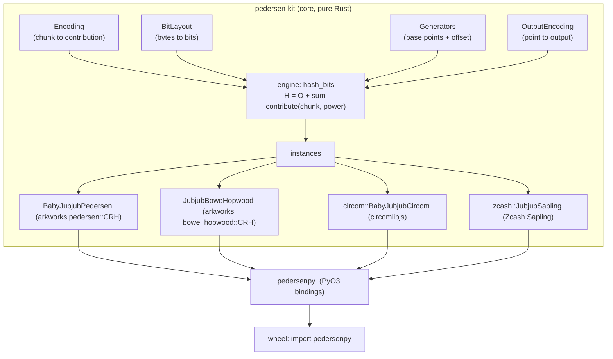
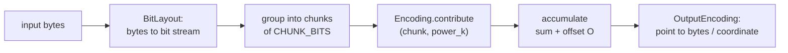
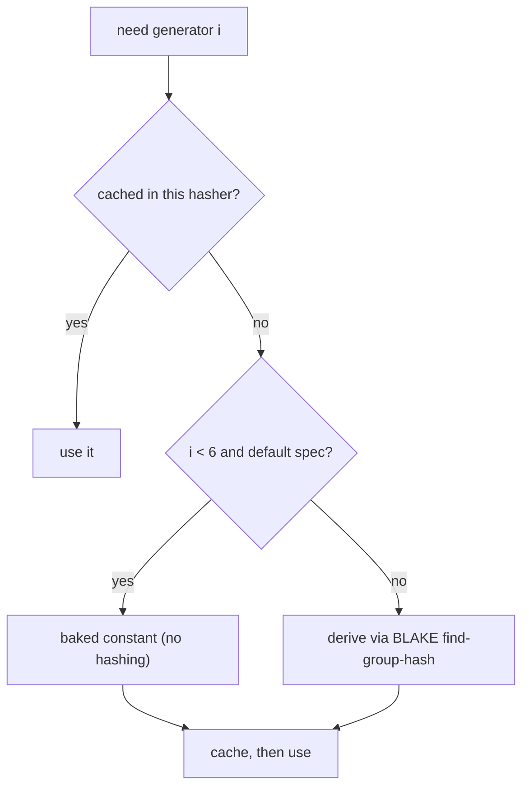

# pedersen-py

**One skeleton for the whole family of widely-known Pedersen hash functions** — over arkworks curves, with Python bindings.

`arkworks`, `circomlib`/`iden3`, and `Zcash Sapling` all define "a Pedersen hash," but their outputs disagree byte-for-byte. This project shows they are the *same* construction with different parameters, implements that construction **once**, and recovers each ecosystem's hash by plugging in the right components — validated **byte-for-byte** against every reference.

---

## Table of contents

- [The idea](#the-idea)
- [Architecture](#architecture)
- [The four axes](#the-four-axes)
- [Curves](#curves)
- [Generators](#generators)
- [Point compression: the circom vs Zcash subtlety](#point-compression-the-circom-vs-zcash-subtlety)
- [Hashers](#hashers)
- [Quick start](#quick-start)
- [Features](#features)
- [Building & installing](#building--installing)
- [Testing & CI](#testing--ci)
- [Project layout](#project-layout)
- [License](#license)
- [References](#references)

---

## The idea

A Pedersen hash maps a message to a sum of scalar multiples of fixed points in a prime-order group $\mathbb{G}$. Collision resistance reduces to the hardness of the discrete logarithm in $\mathbb{G}$. Every member of the family is the single multi-scalar multiplication

$$
H(m) = O + \sum_{k} \mathrm{contribute}\left(c_k, P_k\right),
$$

where the message is turned into a bit stream, the bits are grouped into fixed-size **chunks** $c_k$, each chunk is combined with a precomputed **generator power** $P_k$, the terms are summed, an optional constant **offset** $O$ is added, and the resulting group element is serialized.

What separates the ecosystems is *only* which choices go into that formula — the chunk encoding, the bit order, the generator set, and the output serialization. Those are the four trait "axes" below.

---

## Architecture



The engine is fixed; each hasher is one parameterization. The hashing pipeline:



---

## The four axes

Within a **segment**, consecutive chunks share one base point $G$ and are weighted by a radix $R = 2^{\text{POWER\\_SHIFT}}$; the precomputed powers are $P = \{G, RG, R^2 G, \dots\}$. A new base point begins every $c$ chunks.

### `Encoding` — chunk $\to$ contribution

| Encoding | `CHUNK_BITS` | radix $R$ | digit / contribution |
|---|:---:|:---:|---|
| `Unsigned` (arkworks `pedersen`) | 1 | $2$ | bit $b$: contributes $b \cdot P$ |
| `BoweHopwood` (Zcash / arkworks `bowe_hopwood`) | 3 | $2^4$ | signed digit (below) |
| `Circom` (circomlib) | 4 | $2^5$ | signed 3-bit magnitude + sign (below) |

**Unsigned windows.** A window of bits $b_j$ contributes its binary value times the base:

$$
\sum_{j} b_j 2^{j} G .
$$

**Bowe–Hopwood / Zcash.** Each 3-bit chunk $(s_0,s_1,s_2)$ encodes the signed digit

$$
\mathrm{enc}(s_0,s_1,s_2) = (1 - 2 s_2)(1 + s_0 + 2 s_1) \in \{-4,\dots,-1,1,\dots,4\},
$$

and a segment of $k$ chunks forms the scalar $\displaystyle \langle M_i\rangle = \sum_{j=1}^{k} \mathrm{enc}(c_{i,j}) 2^{4(j-1)}$, so $H = \sum_i \langle M_i\rangle G_i$.

**circom.** Each 4-bit window is 3 magnitude bits and 1 sign bit, giving the digit

$$
\pm\bigl(1 + s_0 + 2 s_1 + 4 s_2\bigr) \in \{-8,\dots,-1,1,\dots,8\},
$$

with windows spaced by $2^{5}$ within a segment.

### `BitLayout` — bytes $\to$ bits
`LsbFirst` (bit $i$ of a byte is $(\text{byte} \gg i)\\&1$ — matches arkworks `bytes_to_bits` and circom `buffer2bits`) and `MsbFirst`.

### `Generators` — base points (and offset)
`Deterministic` (reproducible, generic), or the spec-exact `circom::CircomGenerators` / `zcash::ZcashGenerators` (see [Generators](#generators)).

### `OutputEncoding` — point $\to$ output
`WholePoint` (affine), `Compressed` (bytes), `XCoordinate` (the $x$/$u$ coordinate — Zcash output), `XCoordinateBytes`.

---

## Curves

**Baby Jubjub** ([ERC-2494](https://eips.ethereum.org/EIPS/eip-2494)) is the twisted Edwards curve

$$
A x^2 + y^2 = 1 + D x^2 y^2, \qquad A = 168700, D = 168696,
$$

over $\mathbb{F}_q$ with $q = 21888242871839275222246405745257275088548364400416034343698204186575808495617$ (the BN254 scalar field), cofactor $8$, and a prime-order subgroup of order $\ell$. It is provided by [`ark-babyjubjub`](https://github.com/arkworks-rs/algebra/pull/1123).

> **Note.** `ark-ed-on-bn254` is the *same* curve up to an isomorphism (an $x$-rescaling to the normalized $A = 1$ form) but with a different generator and coordinates, so it is **not** byte-compatible with circom. `ark-babyjubjub` uses the exact ERC-2494 parameters.

**Jubjub** ($a = -1$ twisted Edwards over the BLS12-381 scalar field) is provided by `ark-ed-on-bls12-381` and is Zcash's Sapling curve.

---

## Generators

The spec generators are *not* arbitrary — each ecosystem derives them from a public hash (a "nothing-up-my-sleeve" construction), so byte compatibility requires reproducing that exact hash:

- **circom:** base point $i = 8 \cdot \text{decompress}\bigl(\mathrm{BLAKE\text{-}256}(s)\bigr)$, where the seed $s$ is the ASCII string `"PedersenGenerator_<i>_<t>"` and the try-counter $t$ increments until the digest decodes to a valid curve point.
- **Zcash:** generator $i = 8 \cdot \text{decompress}\bigl(\mathrm{BLAKE2s}(\mathrm{URS} \Vert i)\bigr)$, with BLAKE2s personalized by `Zcash_PH` and $\mathrm{URS}$ a fixed 64-byte string.

To stay fast *and* correct, generators are resolved like this (mirroring `sapling-crypto`, which ships baked constants and re-derives them in a test):



- **Memoized & reusable:** a hasher derives each generator once and caches it; reuse one instance for many hashes.
- **Baked table:** the first 6 generators per curve ship as constants (covering circom inputs $\le 150$ B, Zcash $\le 141$ B) — no hashing needed.
- **BLAKE fallback:** beyond the table (or for a non-default personalization) generators are derived on demand, so **arbitrary-length input** is supported.
- **Drift guard:** a test re-derives the baked constants via the hash and asserts equality.

---

## Point compression: the circom vs Zcash subtlety

Both compress a point to 32 bytes as the $y/v$ coordinate (little-endian) with the *sign* of $x$/$u$ in the top bit — but they define "sign" differently. For a prime $q$, a point and its negation have $x$ and $q - x$; both rules below uniquely pick one:

$$
\text{circom (half):}\quad \text{sign} = \bigl[x > \tfrac{q-1}{2}\bigr]
\qquad\qquad
\text{Zcash (parity):}\quad \text{sign} = x \bmod 2 .
$$

They are individually valid but mutually incompatible, so a compressed point cannot be moved between the ecosystems even on the same curve. (circom also outputs the whole packed point; Zcash outputs only the $u$-coordinate.)

---

## Hashers

| | Rust (`pedersen-kit`) | Python (`pedersenpy`) | Compatible with |
|---|---|---|---|
| Unsigned windows (Baby Jubjub) | `instances::BabyJubjubPedersen` | `BabyJubjubPedersen(segments, bits_per_window)` | arkworks `pedersen::CRH` |
| Bowe–Hopwood (Jubjub) | `instances::JubjubBoweHopwood` | `JubjubBoweHopwood(segments, chunks_per_segment)` | arkworks `bowe_hopwood::CRH` |
| circom / iden3 (Baby Jubjub) | `circom::BabyJubjubCircom` | `CircomPedersen()` | **byte-exact** `circomlibjs pedersenHash` |
| Zcash Sapling (Jubjub) | `zcash::JubjubSapling` | `ZcashPedersen(personalization=b"Zcash_PH")` | **byte-exact** Zcash Sapling |

---

## Quick start

### Rust

```rust
use pedersen_kit::circom::BabyJubjubCircom;

let mut h = BabyJubjubCircom::new();      // reusable: caches generators across calls
let digest: [u8; 32] = h.hash(b"Hello");  // == circomlibjs pedersen.hash("Hello")
```

```rust
use pedersen_kit::zcash::JubjubSapling;

let mut z = JubjubSapling::new();          // default "Zcash_PH" personalization
let u = z.hash(b"Hello");                  // the u-coordinate (a field element)
```

### Python

```python
import pedersenpy

h = pedersenpy.CircomPedersen()
h.hash(b"Hello").hex()
# '0e90d7d613ab8b5ea7f4f8bc537db6bb0fa2e5e97bbac1c1f609ef9e6a35fd8b'  (matches circomlibjs)

z = pedersenpy.ZcashPedersen()             # or ZcashPedersen(b"Zcash_PH")
z.hash(b"Hello")                           # 32-byte little-endian u-coordinate
```

The package ships type stubs (`py.typed` + `.pyi`), so `mypy`/`pyright` and IDEs get full typing.

---

## Features

`pedersen-kit` features (both **on by default**):

- `circom` — the circomlib-compatible instance (pulls `blake-hash`).
- `zcash` — the Zcash Sapling instance (pulls `blake2s_simd`).
- `--no-default-features` — lean core only (`Unsigned` / `BoweHopwood` over the arkworks curves, no blake dependencies).

`pedersenpy` always enables both.

---

## Building & installing

The Baby Jubjub curve comes from [`ark-babyjubjub`](https://github.com/arkworks-rs/algebra/pull/1123), which is **not yet published to crates.io**. Until it merges, the workspace pins it to that PR commit and unifies the arkworks graph via `[patch.crates-io]` at the workspace root. Once it publishes, delete the git dependency and the patch block.

```bash
# Rust
cargo build

# Python wheel (self-contained once built)
maturin build --release -m crates/pedersenpy/Cargo.toml
pip install target/wheels/pedersenpy-*.whl
```

`pedersenpy` is intended to be installed **from a built wheel**, which bundles the compiled extension and needs no git dependency at install time.

---

## Testing & CI

```bash
cargo test -p pedersen-kit                        # arkworks parity, circom/zcash vectors, drift tests
cargo test -p pedersen-kit --no-default-features  # lean core (arkworks parity only)
maturin build -m crates/pedersenpy/Cargo.toml     # build the wheel
```

Coverage, by layer:

- **arkworks parity** — the engine reproduces `pedersen::CRH` and `bowe_hopwood::CRH` bit-for-bit (both curves, several window layouts, an input matrix), by feeding them the same generators.
- **circom & Zcash vectors** — byte-exact against `circomlibjs` and `zcash/zcash-test-vectors`, from empty input through multi-segment inputs that exercise the BLAKE fallback beyond the baked table.
- **drift** — baked generator tables equal their BLAKE derivation.
- **bindings** — a `pytest` suite runs against the *built wheel*, pinning the binding's byte output, constructor handling, and memoized reuse.
- **types** — `mypy` checks the shipped stubs against real usage.

CI runs two jobs: **rust** (`fmt`, `clippy -D warnings`, `test` default + `--no-default-features`) and **wheel** (`maturin build`, `mypy`, `pytest`, artifact upload).

---

## Project layout

```
pedersen-py/
├── Cargo.toml                     # workspace + [patch.crates-io] → ark-babyjubjub PR
├── LICENSE                        # MIT
├── crates/
│   ├── pedersen-kit/              # core library
│   │   ├── src/{lib,components,instances,circom,zcash}.rs
│   │   └── tests/{parity,circom,zcash}.rs
│   └── pedersenpy/                # PyO3 bindings
│       ├── src/lib.rs
│       ├── python/pedersenpy/     # __init__.py, __init__.pyi, py.typed
│       └── tests/                 # typing_smoke.py, test_vectors.py
└── .github/workflows/ci.yml
```

---

## License

Licensed under the [MIT License](LICENSE).

---

## References

- [EIP-2494: Baby Jubjub Elliptic Curve](https://eips.ethereum.org/EIPS/eip-2494)
- [arkworks-rs/algebra](https://github.com/arkworks-rs/algebra) and [ark-crypto-primitives](https://github.com/arkworks-rs/crypto-primitives)
- [iden3/circomlib](https://github.com/iden3/circomlib) and [circomlibjs](https://github.com/iden3/circomlibjs)
- [Zcash Protocol Specification](https://zips.z.cash/protocol/protocol.pdf) (§5.4.1.7, Pedersen hashes) and [zcash-test-vectors](https://github.com/zcash/zcash-test-vectors)
