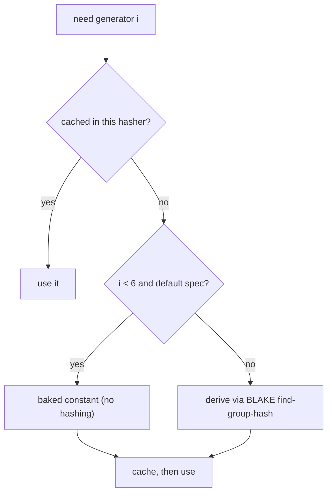

# Compatibility & curves

## Curves

**Baby Jubjub** ([ERC-2494](https://eips.ethereum.org/EIPS/eip-2494)) is the twisted Edwards curve

$$
A x^2 + y^2 = 1 + D x^2 y^2, \qquad A = 168700,\; D = 168696,
$$

over $\mathbb{F}_q$ with $q = 21888242871839275222246405745257275088548364400416034343698204186575808495617$ (the BN254 scalar field), cofactor $8$, and a prime-order subgroup of order $\ell$. Provided by [`ark-babyjubjub`](https://github.com/arkworks-rs/algebra/pull/1123).

!!! warning "`ark-ed-on-bn254` ≠ circom's Baby Jubjub coordinates"
    `ark-ed-on-bn254` is the *same* curve up to an isomorphism (an $x$-rescaling to the normalized $A = 1$ form), but with a different generator and coordinates — so it is **not** byte-compatible with circom. `ark-babyjubjub` uses the exact ERC-2494 parameters.

**Jubjub** ($a = -1$ twisted Edwards over the BLS12-381 scalar field) is Zcash's Sapling curve, provided by `ark-ed-on-bls12-381`.

## Generators

Spec generators are derived from a public hash (a "nothing-up-my-sleeve" construction), so byte compatibility requires reproducing that exact hash:

- **circom:** base point $i = 8 \cdot \operatorname{decompress}\bigl(\mathrm{BLAKE\text{-}256}(s)\bigr)$, where the seed $s$ is the ASCII string `"PedersenGenerator_<i>_<t>"` and the try-counter $t$ increments until the digest decodes to a valid curve point.
- **Zcash:** generator $i = 8 \cdot \operatorname{decompress}\bigl(\mathrm{BLAKE2s}(\mathrm{URS} \,\Vert\, i)\bigr)$, with BLAKE2s personalized by `Zcash_PH` and $\mathrm{URS}$ a fixed 64-byte string.

Generators are resolved fast **and** correctly (mirroring `sapling-crypto`, which ships baked constants and re-derives them in a test):

- **Memoized & reusable** — a hasher derives each generator once and caches it.
- **Baked table** — the first 6 generators per curve ship as constants (circom inputs ≤ 150 B, Zcash ≤ 141 B) with no hashing.
- **BLAKE fallback** — beyond the table (or for a non-default personalization), generators are derived on demand, so arbitrary-length input works.
- **Drift guard** — a test re-derives the baked constants via the hash and asserts equality.

## Point compression: circom vs Zcash

Both compress a point to 32 bytes as the $y$/$v$ coordinate (little-endian) with the *sign* of $x$/$u$ in the top bit — but they define "sign" differently. For a prime $q$, a point and its negation have $x$ and $q - x$; both rules below uniquely pick one:

$$
\text{circom (half):}\quad \text{sign} = \bigl[\,x > \tfrac{q-1}{2}\,\bigr]
\qquad\qquad
\text{Zcash (parity):}\quad \text{sign} = x \bmod 2 .
$$

Individually valid, mutually incompatible — a compressed point cannot be moved between the ecosystems even on the same curve. (circom outputs the whole packed point; Zcash outputs only the $u$-coordinate.)

## Validation

Every claim of compatibility is a test:

| Layer | What is checked | Against |
|---|---|---|
| arkworks parity | engine == `pedersen::CRH` and `bowe_hopwood::CRH`, bit-for-bit | `ark-crypto-primitives` (shared generators, both curves, several window layouts, input matrix) |
| circom vectors | byte-exact packed output | `circomlibjs` (empty → multi-segment, incl. BLAKE fallback) |
| Zcash vectors | byte-exact u-coordinate | `zcash/zcash-test-vectors` (empty → multi-segment) |
| drift | baked generator tables == BLAKE derivation | internal |
| bindings | Python byte output, constructors, reuse | `pytest` against the built wheel |
| types | shipped stubs match real usage | `mypy` |
