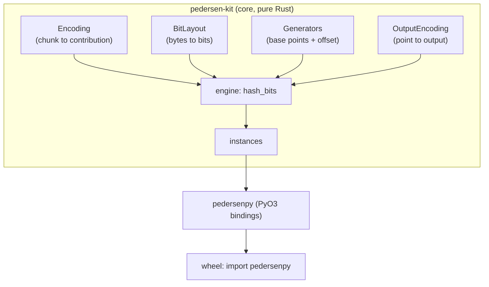
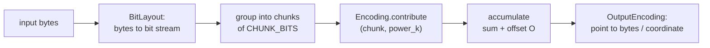

# Concepts

## The idea

A Pedersen hash maps a message to a sum of scalar multiples of fixed points in a prime-order group $\mathbb{G}$. Collision resistance reduces to the hardness of the discrete logarithm in $\mathbb{G}$. Every member of the family is the single multi-scalar multiplication

$$
H(m) \;=\; O \;+\; \sum_{k} \mathrm{contribute}\!\left(c_k,\; P_k\right),
$$

where the message becomes a bit stream, the bits are grouped into fixed-size **chunks** $c_k$, each chunk is combined with a precomputed **generator power** $P_k$, the terms are summed, an optional constant **offset** $O$ is added, and the resulting group element is serialized.

What separates the ecosystems is *only* which choices go into that formula. Those are the four trait "axes."

## Architecture



The hashing pipeline:



## The four axes

Within a **segment**, consecutive chunks share one base point $G$ and are weighted by a radix $R = 2^{\text{POWER\_SHIFT}}$; the precomputed powers are $\{G,\, R\,G,\, R^2 G, \dots\}$. A new base point begins every $c$ chunks.

### `Encoding` — chunk → contribution

| Encoding | `CHUNK_BITS` | radix $R$ | digit |
|---|:---:|:---:|---|
| `Unsigned` (arkworks `pedersen`) | 1 | $2$ | bit $b$ → $b \cdot P$ |
| `BoweHopwood` (Zcash / arkworks `bowe_hopwood`) | 3 | $2^4$ | signed 3-bit (below) |
| `Circom` (circomlib) | 4 | $2^5$ | signed 3-bit magnitude + sign (below) |

**Unsigned windows** contribute the window's binary value times the base:

$$
\sum_{j} b_j\, 2^{j}\, G .
$$

**Bowe–Hopwood / Zcash.** Each 3-bit chunk $(s_0,s_1,s_2)$ encodes the signed digit

$$
\mathrm{enc}(s_0,s_1,s_2) \;=\; (1 - 2 s_2)\,(1 + s_0 + 2 s_1) \;\in\; \{-4,\dots,-1,1,\dots,4\},
$$

and a segment of $k$ chunks forms the scalar $\displaystyle \langle M_i\rangle = \sum_{j=1}^{k} \mathrm{enc}(c_{i,j})\, 2^{4(j-1)}$, so $H = \sum_i \langle M_i\rangle\, G_i$.

**circom.** Each 4-bit window is 3 magnitude bits and 1 sign bit, giving the digit

$$
\pm\bigl(1 + s_0 + 2 s_1 + 4 s_2\bigr) \;\in\; \{-8,\dots,-1,1,\dots,8\},
$$

with windows spaced by $2^{5}$ within a segment.

### `BitLayout` — bytes → bits

`LsbFirst` (bit $i$ of a byte is $(\text{byte} \gg i)\,\&\,1$ — matches arkworks `bytes_to_bits` and circom `buffer2bits`) and `MsbFirst`.

### `Generators` — base points (and offset)

`Deterministic` (reproducible, generic), or the spec-exact `circom::CircomGenerators` / `zcash::ZcashGenerators`. See [Compatibility & curves](compatibility.md#generators).

### `OutputEncoding` — point → output

`WholePoint` (affine), `Compressed` (bytes), `XCoordinate` (the $x$/$u$ coordinate — Zcash output), `XCoordinateBytes`.

## Putting it together

A concrete hasher is one type — for example the circom instance is

```rust
type BabyJubjubCircom = Pedersen<EdwardsProjective, Circom, LsbFirst, Packed>;
```

`Encoding = Circom`, `BitLayout = LsbFirst`, `Generators = CircomGenerators`, `OutputEncoding = Packed` (babyjub `packPoint`).
