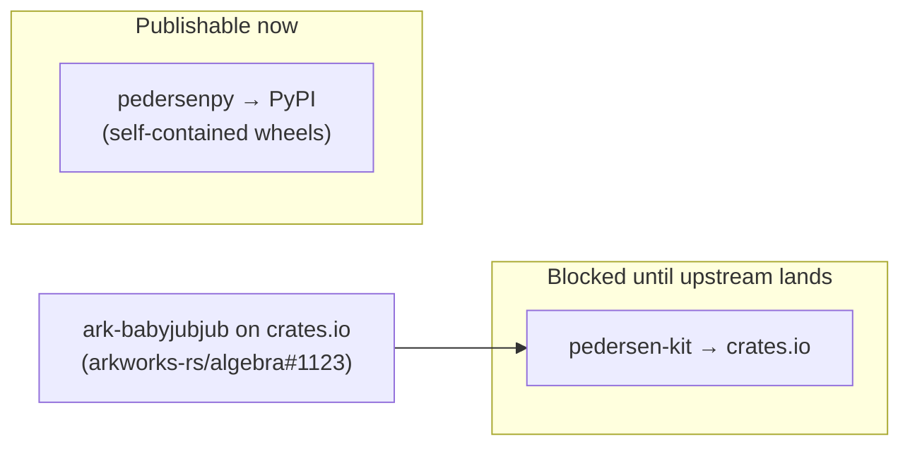

# Publishing

The two artifacts publish to different registries and are **not** on the same timeline.



## The crates.io blocker

`pedersen-kit` depends on **`ark-babyjubjub` via a git revision** (the ERC-2494 curve isn't published yet), and it relies on a workspace `[patch.crates-io]` to unify the arkworks graph.

**crates.io forbids git dependencies and ignores `[patch]`.** So `pedersen-kit` **cannot** be published until `ark-babyjubjub` is released on crates.io.

When it lands:

1. In `crates/pedersen-kit/Cargo.toml`, replace the git dependency with a version:
   ```toml
   ark-babyjubjub = "0.x"
   ```
2. Delete the `[patch.crates-io]` block from the workspace root `Cargo.toml`.
3. Add a `CARGO_REGISTRY_TOKEN` repository secret, then set the repository variable `PUBLISH_CRATE = true` to enable the (currently gated) `crates` job in the release workflow — or publish manually:
   ```bash
   cargo test -p pedersen-kit
   cargo publish -p pedersen-kit
   ```

`pedersenpy` is a PyO3 extension (`cdylib`) — it is published to **PyPI**, not crates.io.

## PyPI (`pedersenpy`) — works today

The wheel compiles the git dependency **at build time** and bundles the result, so the installed wheel is self-contained and needs no git access. Because the extension uses `abi3` (stable ABI, `py39`), one wheel per platform covers all Python ≥ 3.9.

### Local

```bash
maturin build --release -m crates/pedersenpy/Cargo.toml
# → target/wheels/pedersenpy-0.1.0-cp39-abi3-<platform>.whl
```

### Release workflow

The repository ships [`.github/workflows/release.yml`](https://github.com/luksgrin/pedersen-py/blob/main/.github/workflows/release.yml), triggered on `v*` tags. It builds abi3 wheels for Linux (manylinux), macOS (arm64 + x86_64), and Windows with [`PyO3/maturin-action`](https://github.com/PyO3/maturin-action), then publishes to PyPI via **[Trusted Publishing (OIDC)](https://docs.pypi.org/trusted-publishers/)** — no API token.

**One-time setup**

1. On PyPI, register a Trusted Publisher for this repository, workflow `release.yml`, environment `pypi`.
2. Create a GitHub Actions environment named `pypi`.

**Cutting a release**

1. Bump the version in `crates/pedersenpy/Cargo.toml`, `crates/pedersen-kit/Cargo.toml`, and `crates/pedersenpy/pyproject.toml` (the workflow fails if the tag doesn't match).
2. `git tag vX.Y.Z && git push origin vX.Y.Z`.

A `workflow_dispatch` run builds the wheels without publishing (useful for testing).

!!! note "sdist caveat"
    An sdist (source distribution) would try to resolve the `ark-babyjubjub` git dependency at install time on the user's machine. Ship **wheels only** until the crate is published, or omit the sdist from the release.

## Versioning

Keep `crates/pedersen-kit/Cargo.toml`, `crates/pedersenpy/Cargo.toml`, and `crates/pedersenpy/pyproject.toml` in lockstep, and tag releases `vMAJOR.MINOR.PATCH`.
