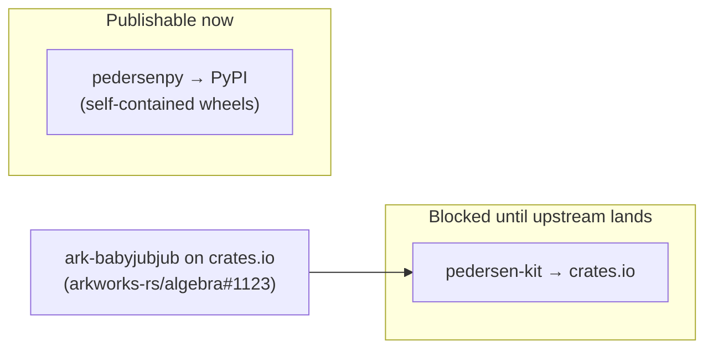

# Publishing

The two artifacts publish to different registries and are **not** on the same timeline.



## The crates.io blocker

`pedersen-kit` depends on **`ark-babyjubjub` via a git revision** (the ERC-2494 curve isn't published yet), and it relies on a workspace `[patch.crates-io]` to unify the arkworks graph.

**crates.io forbids git dependencies and ignores `[patch]`.** So `pedersen-kit` **cannot** be published until `ark-babyjubjub` is released on crates.io.

When it lands:

1. In `crates/pedersen-kit/Cargo.toml`, replace the git dependency with a version:
   ```toml
   ark-babyjubjub = "0.x"
   ```
2. Delete the `[patch.crates-io]` block from the workspace root `Cargo.toml`.
3. Verify and publish:
   ```bash
   cargo test -p pedersen-kit
   cargo publish -p pedersen-kit
   ```

`pedersenpy` is a PyO3 extension (`cdylib`) — it is published to **PyPI**, not crates.io.

## PyPI (`pedersenpy`) — works today

The wheel compiles the git dependency **at build time** and bundles the result, so the installed wheel is self-contained and needs no git access. Because the extension uses `abi3` (stable ABI, `py39`), one wheel per platform covers all Python ≥ 3.9.

### Local

```bash
maturin build --release -m crates/pedersenpy/Cargo.toml
# → target/wheels/pedersenpy-0.1.0-cp39-abi3-<platform>.whl
```

### Release workflow (multi-platform wheels)

Use [`PyO3/maturin-action`](https://github.com/PyO3/maturin-action) to build Linux (manylinux), macOS, and Windows wheels on a tag, then publish. Sketch:

```yaml
name: Release
on:
  push:
    tags: ["v*"]

jobs:
  wheels:
    strategy:
      matrix:
        os: [ubuntu-latest, macos-latest, windows-latest]
    runs-on: ${{ matrix.os }}
    steps:
      - uses: actions/checkout@v4
      - uses: PyO3/maturin-action@v1
        with:
          command: build
          args: --release -m crates/pedersenpy/Cargo.toml
          manylinux: auto
      - uses: actions/upload-artifact@v4
        with: { name: wheels-${{ matrix.os }}, path: target/wheels/*.whl }

  publish:
    needs: wheels
    runs-on: ubuntu-latest
    environment: pypi          # configure PyPI Trusted Publishing for this repo/environment
    permissions: { id-token: write }
    steps:
      - uses: actions/download-artifact@v4
        with: { path: dist, merge-multiple: true }
      - uses: pypa/gh-action-pypi-publish@release/v1
        with: { packages-dir: dist }
```

Prefer **[PyPI Trusted Publishing (OIDC)](https://docs.pypi.org/trusted-publishers/)** over long-lived API tokens.

!!! note "sdist caveat"
    An sdist (source distribution) would try to resolve the `ark-babyjubjub` git dependency at install time on the user's machine. Ship **wheels only** until the crate is published, or omit the sdist from the release.

## Versioning

Keep `crates/pedersen-kit/Cargo.toml`, `crates/pedersenpy/Cargo.toml`, and `crates/pedersenpy/pyproject.toml` in lockstep, and tag releases `vMAJOR.MINOR.PATCH`.
